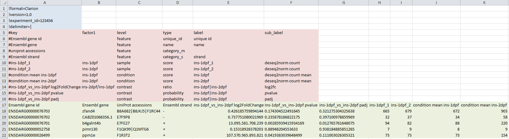
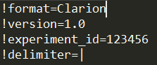
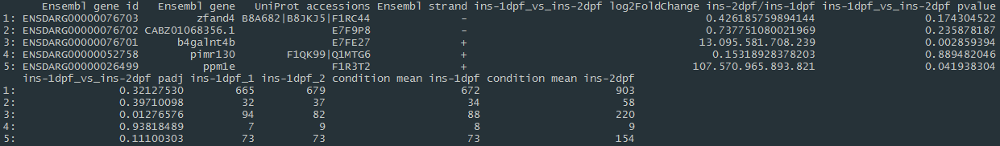

# Data Format

  <b>CLARION: generiC fiLe formAt foR quantItative cOmparsions of high throughput screeNs</b>
    
   CLARION is a data format especially developed to be used with WIlsON, which relies on a tab-delimited table with a metadata header to describe the following columns. It is based on the Summarized Experiment format and supports all types of data which can be reduced to features (e.g. genes, transcripts, proteins, probes) with assigned numerical values (e.g. count, score, log2foldchange, zscore, pvalue). Most result tables derived from RNA-Seq, ChIP/ATAC-Seq, Proteomics, Microarrays, and many other analyses can thus be easily reformatted to become compatible, without having to modify the code of WIlsON for each specific experiment.
    
  
    
  

  The format consists of three blocks of data with distinct structures:
  <ul class="font">
    <li><b>Header</b>: Parameters concerning the global experiment</li>
    <li><b>Metadata</b>: Parameters describing the content of each data column</li>
    <li><b>Data</b>: Matrix of data columns bearing textual and numerical information per feature</li>
  </ul>
  

 
##  Header:

  <ul class="font">
    <li>Line identifier '!'</li>
    <li>Syntax: name = value</li>
    <li>Mandatory columns: *</li>
  </ul>

### Parameters:

  <ul class="font">
    <li><b>format</b>: Name of the file format (must be Clarion)</li>
    <li><b>version</b>: Version of the file format (1.0)</li>
    <li><b>experiment_id</b>: Unique id to be used for the experiment</li>
    <li><b>delimiter</b>: In-field delimiter for multi-value fields (e.g. multiple kegg pathways)</li>
  </ul>

 
##  Metadata:

  <ul class="font">
    <li>Line identifier '#'</li>
    <li>Mandatory columns: *</li>
  </ul>

### Columns:

  <ul class="font">
    <li><b>key</b>*:</li>
      <ul class="font">
        <li>Reference to data matrix (column headline)</li>
        <li>Must be unique</li>
      </ul>
    <li><b>factor1 - factorN</b>:</li>
      <ul class="font"><li>Denotes experimental factors (e.g. wildtype, mutant, time point) per sample and condition</li></ul>
      <ul class="font"><li>One or more columns (factor1, factor2, ..., factorN)</li></ul>
      <ul class="font"><li>Used for grouping</li></ul>
    <li><b>level</b>*:</li>
      <ul class="font">
        <li>Classifies content of column</li>
        <li>Must be one of:</li>
        <ul class="font">
          <li><i>sample:</i> Data relating to a single sample</li>
          <li><i>condition:</i> Data relating to a single condition</li>
          <li><i>contrast:</i> Data relating to a single contrast (pairwise comparison of conditions)</li>
          <li><i>feature:</i> Annotation relating to a feature</li>
        </ul>
      </ul>
    <li><b>type</b>:</li>
      <ul class="font">
        <li>Further classify content level</li>
        <li>Must be one of:</li>
        <li>For level = feature = values to be filtered for</li>
        <ul class="font">
          <li><i>unique_id:</i> Unique identifier</li>
          <li><i>name:</i> Main feature name / symbol / label</li>
          <li><i>category_s:</i> Single value per field; categorical data</li>
          <li><i>category_m:</i> Multiple delimited values per field; categorical data</li>
        </ul>
        <li>For levels = sample, condition, contrast = values to be plotted</li>
        <ul class="font">
          <li><i>score:</i> count, intensity, ...</li>
          <li><i>ratio:</i> foldchange, log2foldchange, ...</li>
          <li><i>probability:</i> pvalue, padj, ...</li>
          <li><i>category_s:</i> Categorical data (not numeric); single value per field</li>
          <li><i>category_m:</i> Categorical data (not numeric); multiple values per field</li>
        </ul>
      </ul>
    <li><b>label</b>:</li>
      <ul class="font">
        <li>Optional label alternative to column name</li>
        <li>Can be used for plotting</li>
        <li>Should be unique</li>
        <li>For level = contrast delimited by '|' (condition1|condition2)</li>
      </ul>
    <li><b>sub_label</b>:</li>
      <ul class="font"><li>Optional more detailed label to permit further branching</li></ul>
  </ul>

 
##  Data:

  <ul class="font">
    <li>Traditional tab-delimited data matrix</li>
    <li>Minimum: one column with a unique id; one column with a numerical value</li>
  </ul>

