<head>
 
</head>

# WIlsON: Webbased Interactive Omics visualizatioN

 The WIlsON app is based on a tab-delimited input file format called <a href="https://github.molgen.mpg.de/loosolab/wilson-apps/edit/master/wilson-basic/introduction/format.md">CLARION</a> derived from the "summarized experiment" format. All types of data which can be broken down to a feature with assigned numerical values can be deployed on the WIlsON server (e.g. multi-omics). A user can then generate various plots following four basic steps: 
 
 <ol class="font">
 <li>Filter for features of interest based on categorical or numerical values (e.g. transcripts, genes, proteins, probes)</li>
 <li>Select plot type</li>
 <li>Adjust plot parameters</li>
 <li>Render/download result</li>
 </ol>

##  Examples

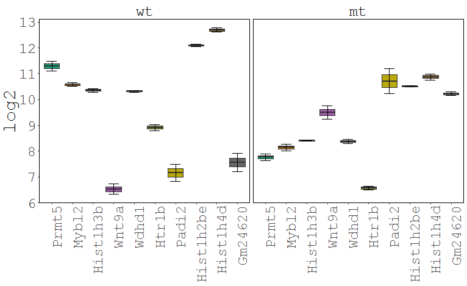
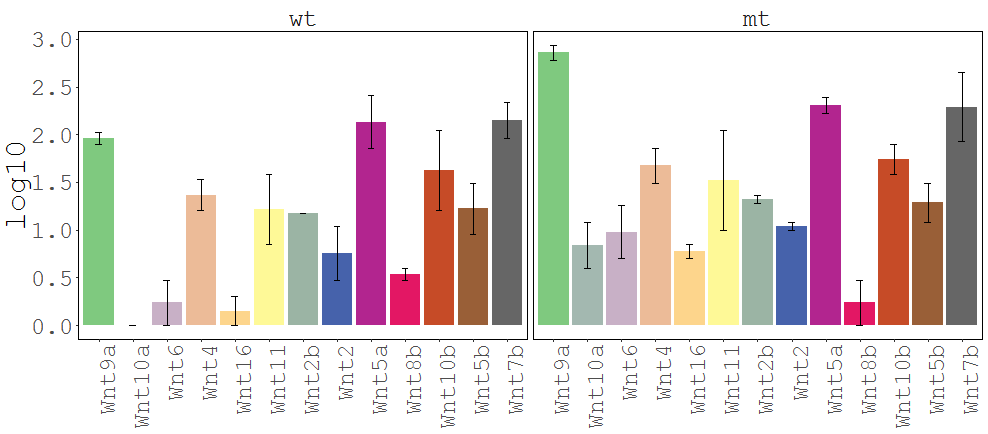

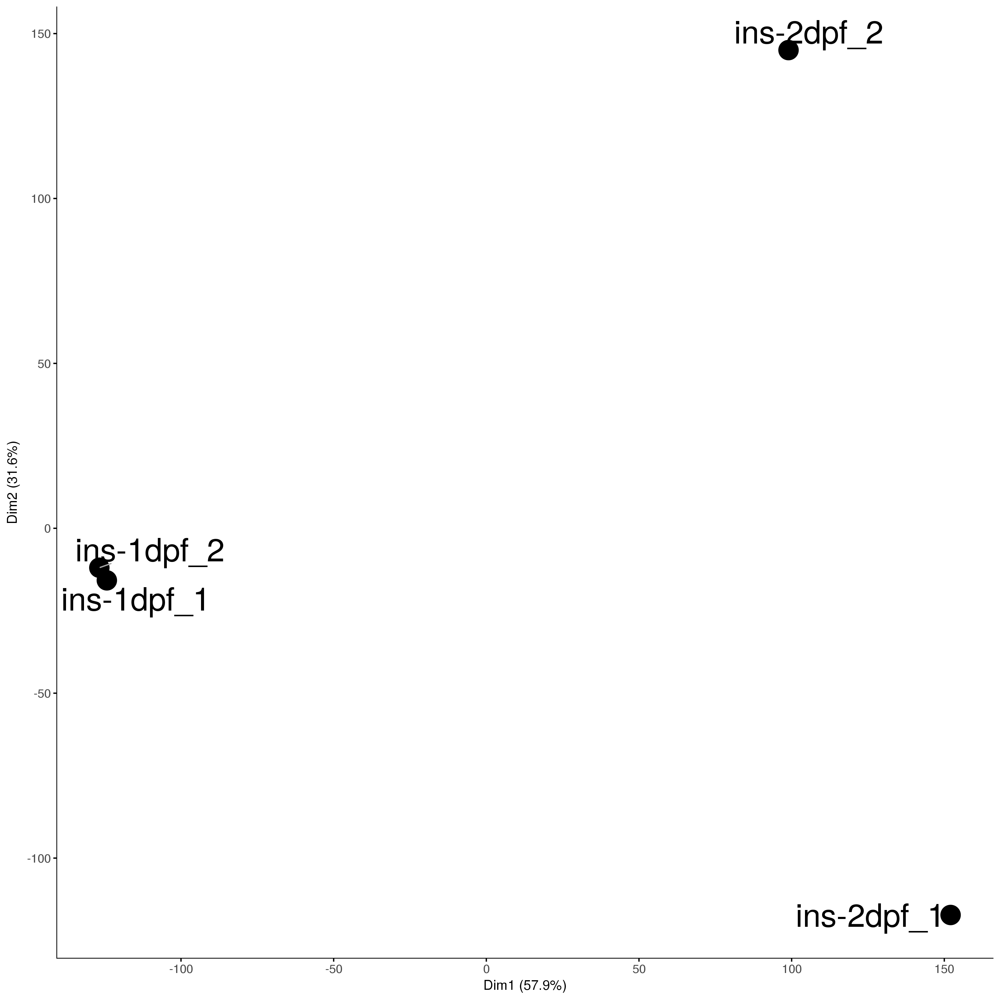
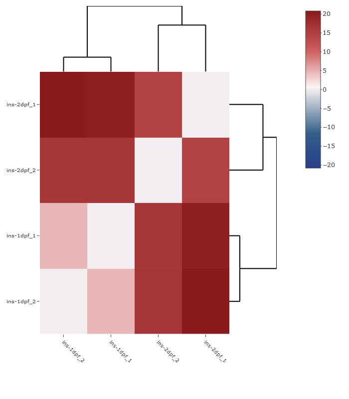
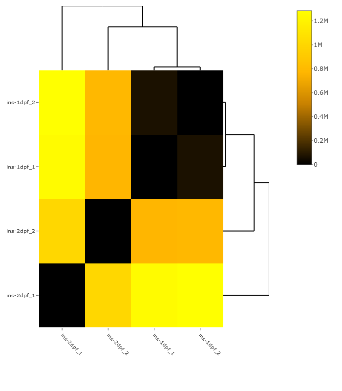
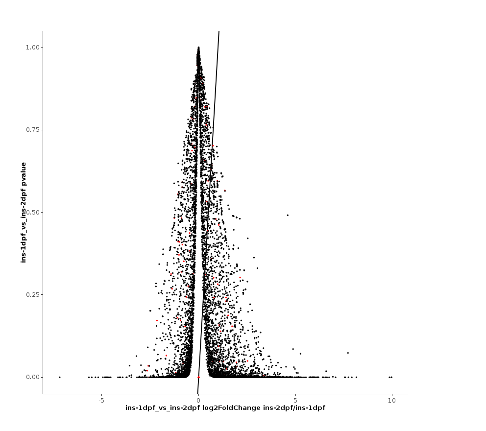
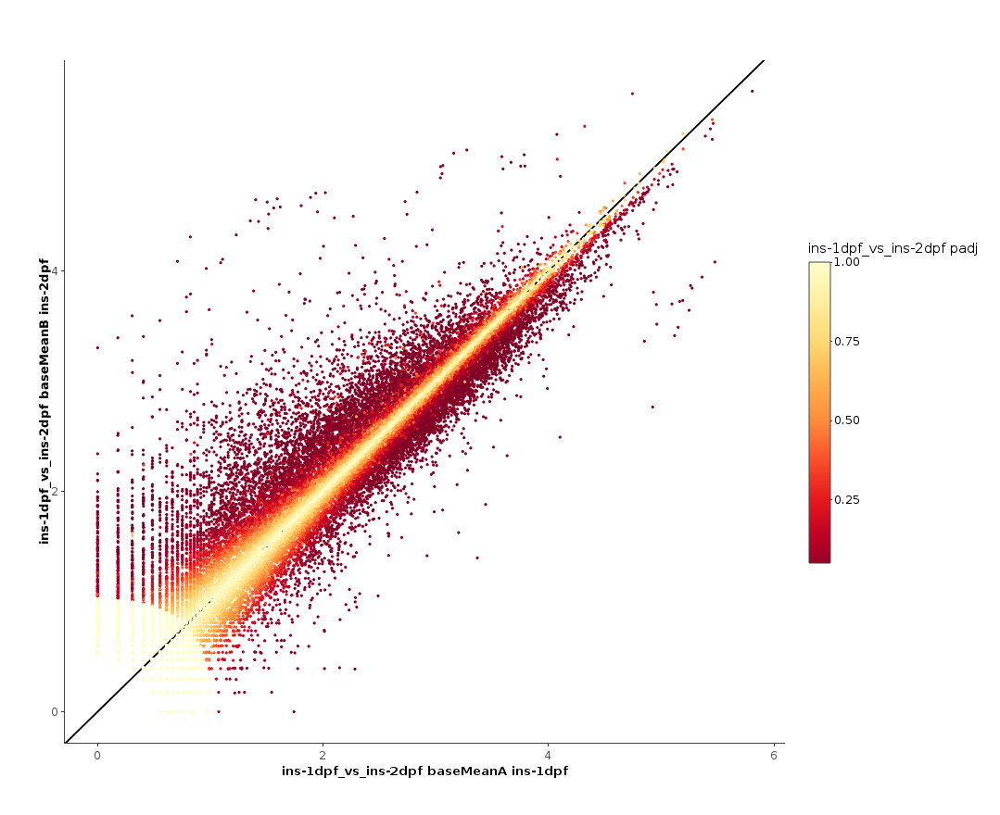
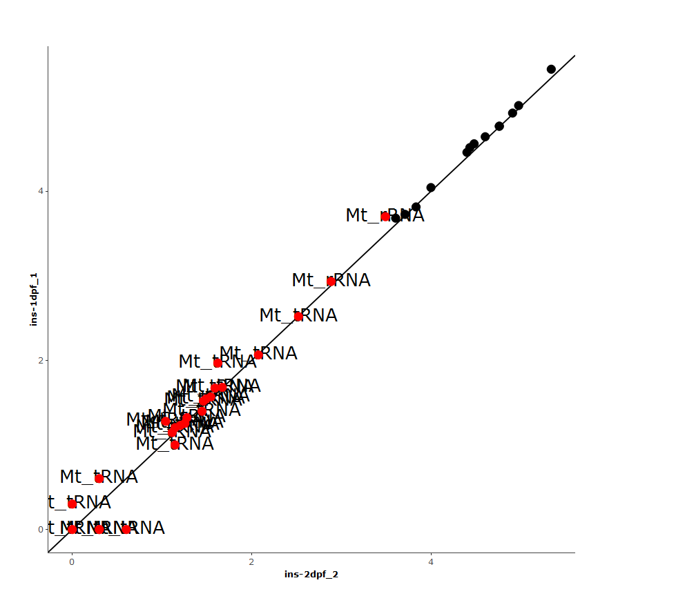
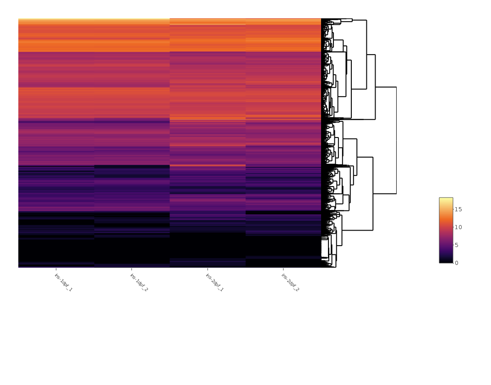
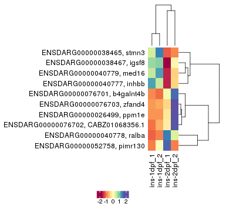

##  Basic Structure

##  Basic Structure

 The layout of each page is fairly similar. The top bar permits selection of a plotting application while the remaining space is usually divided the following way:

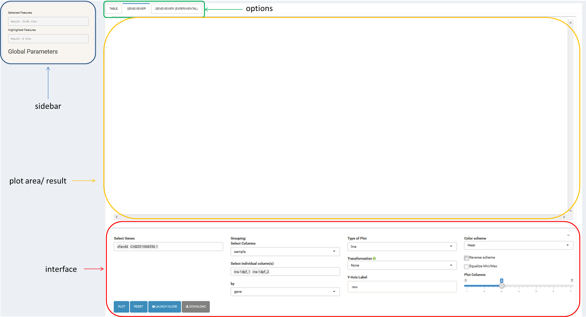
### Sidebar

 It shows the currently selected features as well as global parameters depending on the plot/filter.

### Options

 These tabs provide access to several subsections:  plots, plot variants, filters or data tables. Tables contain the specific subset of data used for the plot.

### Plot area / result

 This area will show the result of the current rendering/filtering: either a plot or the data as a table.

### Interface

 The bottom interface contains most of the parameters defining a plot, including axis transformation, coloring etc.

##  Feature Selection

 As mentioned above, the first step of WILsON is to select the tab "Feature Selection" at the top menue. This allows to select a subset of data to be used for plotting by applying filtering steps (without filtering all features of the dataset will be plotted).
 The table at the top of the "Feature Selection" page displays the current selection. Several tabs located below the table are intended for filtering steps based on various criteria available per feature. WILsON supports a presorting for sample, condition, and contrasts among others.
 The "highlight" pane supports the creation of a subset of the selected features. The highlighted data can be used in certain plots which support highlighting (e.g. scatterplot) to either add a fixed color or labels.
 After filtering, plots of interest can be selected and generated via the tabs on top.

### Table
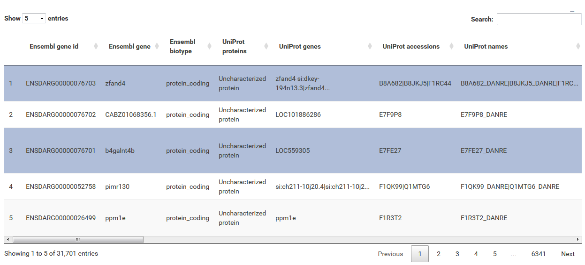

 <i>This is an example on a dataset filtered for various criteria. Within the selected feature table browsing, sorting and selection is supported. Some cells are truncated due to long text blocks('...'): to display these data just hover over the specific cell.</i>

### Filter

 Based on the columns content (textual, numeric) WIlsON's Feature Selector will provide appropriate filter interfaces to enable an efficient way to select data.

#### **Textual (Annotation)**
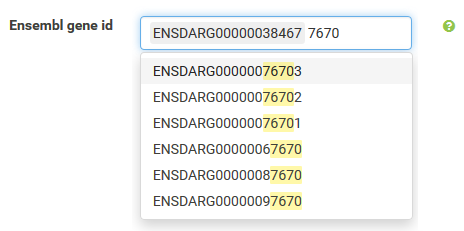

<i>
 Annotations can be filtered by clicking a dropdown menu containing all available values. The filter box supports querying as well. 'Backspace' can be used to deselect prior selections.
</i>

#### **Numeric (Value)**
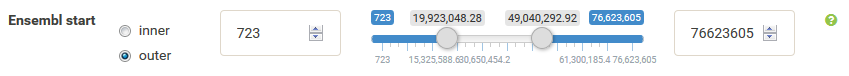

<i>
 This filter is intented to select a numeric range. The 'inner' or 'outer' options allows the definition of either the range within the set markers (inner) or outside of the marker (outer), which is also displayed trough the slider coloring. As the step size is scaled according to the spread of the data, editable value fields aside the slider can be utilized to change the minimum and maximum value (slider range is recalculated).
</i>

### Additional options

 Once the data is filtered, the remaining subset of features is displayed in the table on top of the feature selection page (see table above). This selection can be narrowed down further by e.g. a keyword search field on the top right of the table. Additionally, manual selection of rows by marking is supported as well. Sorting on specific columns by clicking the <b>column title</b> can help to find specific features of interest. Once the table is sorted correctly, it can be filtered for a specific number of entries.

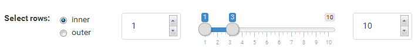 

<i>Specific <b>rows</b> (row numbers) can be selected from the feature table via the slider shown above, a powerful filter in combination with column sorting and numeric filtering on e.g. fold changes. This could be used to e.g. generate a list of the top 50 up and down regulated genes on chromosome 3.
</i>

##  Plots

### Gene View

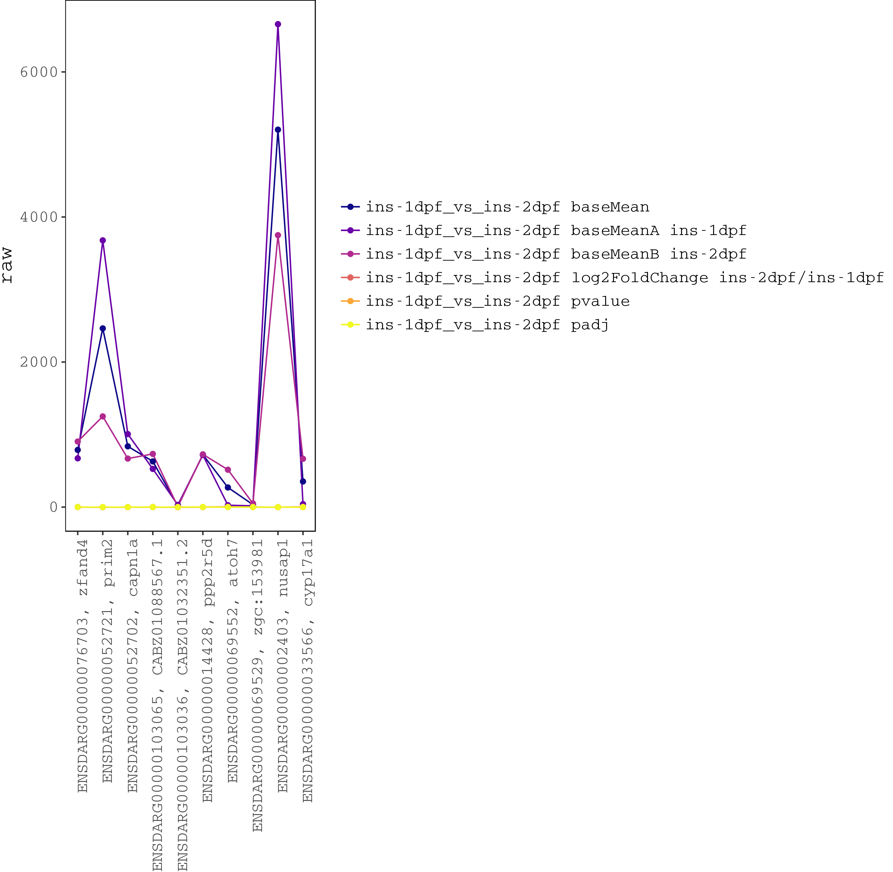
 The Gene Viewer consists of multiple plot types including line-, box-, violin- & barplots. It supports the visualization and comparison of individual genes and/or conditions.

### Data Reduction
#### PCA (Principal Component Analysis)

 
 A PCA is used to get an overview on the variation of the data based on the selected features. By default the two dimensions with the highest variation are selected (PC1 and PC2) and presented in a two-dimensional scatterplot.

#### Global Correlation Heatmap

 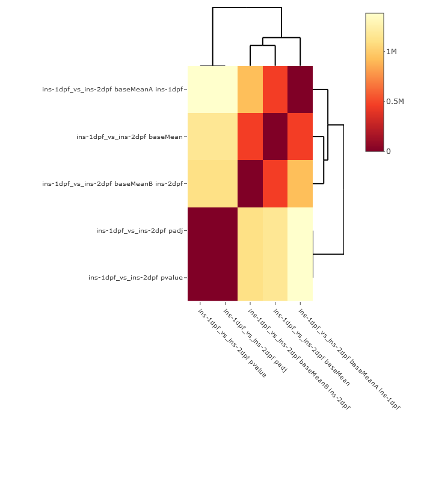
 Similar to the PCA, this plot will show the global clustering of samples or conditions based on the selected features. A distance matrix is created using one of various options (e.g. euclidean, pearson, spearman, etc.) and visualized by a heatmap.

### Scatterplot

 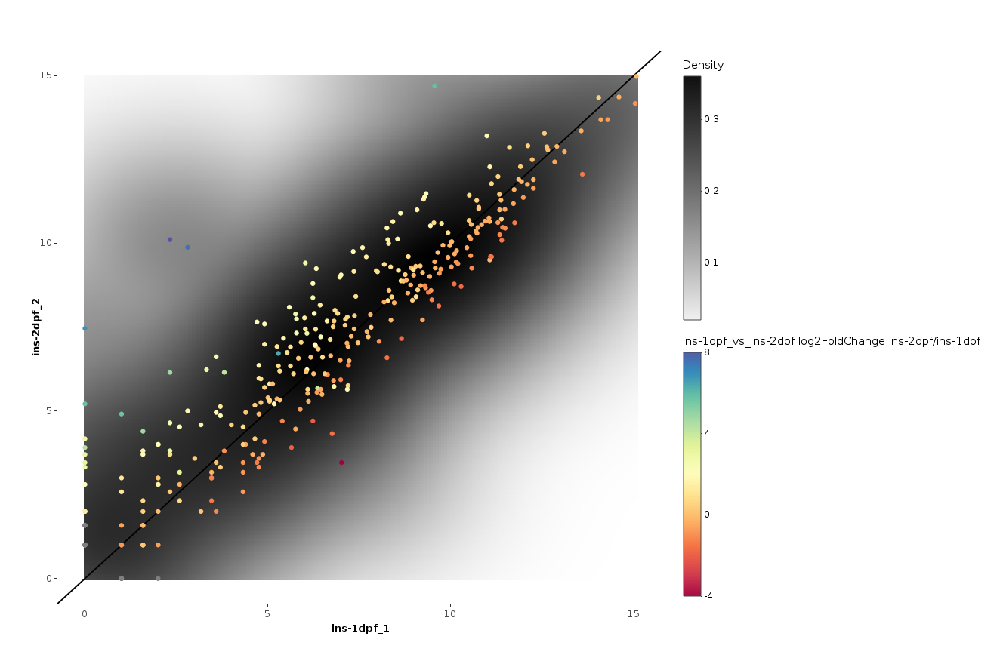
 This plot illustrates the dependency of two (X/Y axes) or three (X/Y/color) attributes. It supports a density estimation (kernel smoothing) and trend lines. The axes to be displayed can be chosen among the numeric columns to e.g. create Volcano, MA, or other kinds of scatter plots. The scatterplot supports highlighting of a subset of data (feature selection, pane highlight).

### Heatmap

 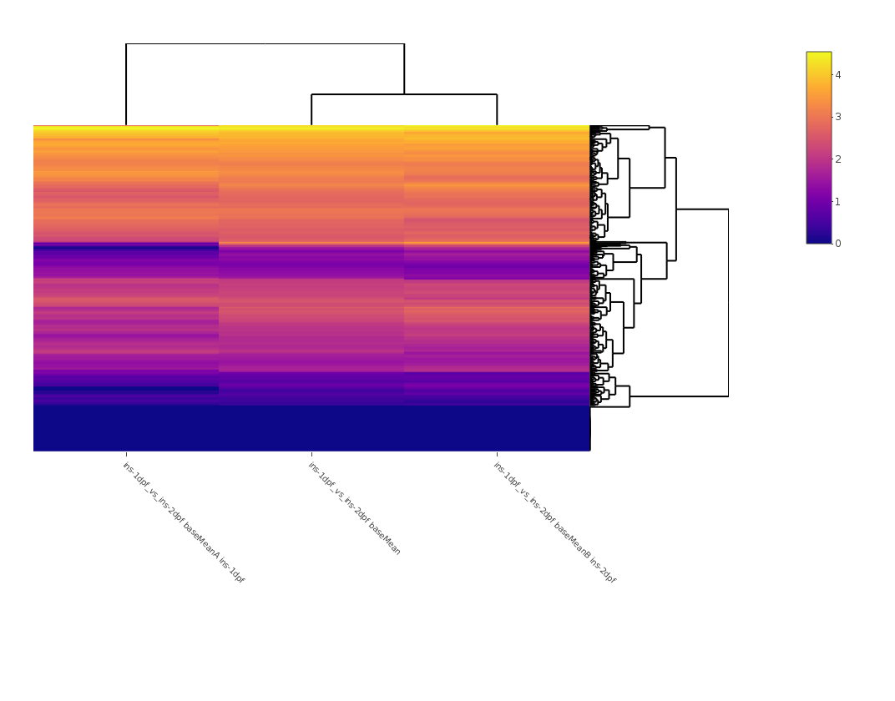
 Various parameters permit the creation of highly customized heatmaps of the selected features. Among these are different kinds of clusterings, transformations (log2, log10, rlog, zscore), and color schemes. The Heatmap module supports interactive and static heatmaps.

##  Interactivity

Thanks to the plotly package, several plots are available as an interactive version offering a range of additional options:

<ul class="font">
  <li>Zoom / pan plot (either via UI or directly in plot)</li>
  <li>Mouse-over popup text box containing information of the selected feature</li>
  <li>Download currently selected viewport</li>
</ul>

<b>It should be noted that the plotly plot versions generate a higher computational load (slower) than the default ggplot2 versions.</b>
 

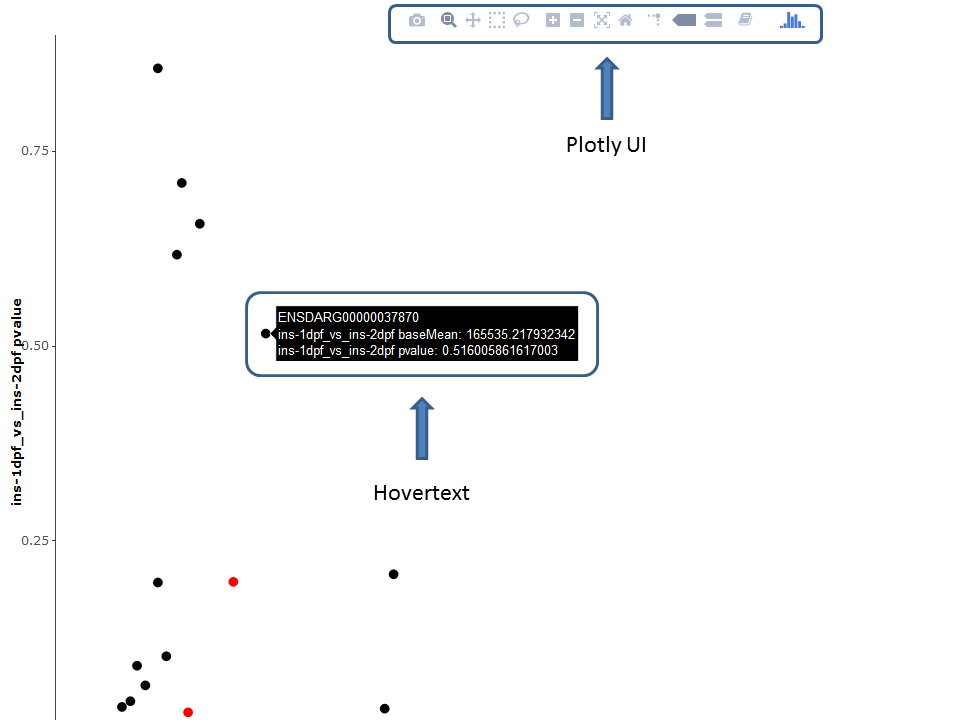

##  Help

 <ul class="font">
 <li>All plots include an interactive help section. Click on  for a step by step tour on how to use the current interface.</li>
 <li>Even more details are given with the  symbols.</li>
 </ul>

##  Use Cases

### Case 1

<b>Create a heatmap of significantly differentially expressed protein coding genes involved in BMP signaling pathway</b> 
 
 Whenever planning a plot it is vital to filter the available features/values down to the required set. By default the whole dataset will be used, which might result in a non-sensical plot and a warning message.

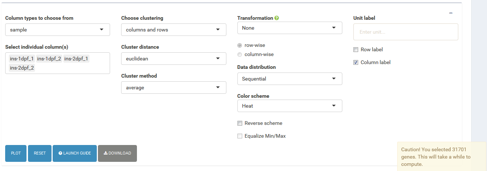

 In order to filter, use the Feature Selection tab in a first step. For this example we want to filter for significantly differentially expressed genes, which is done on the <b>contrast</b> level. Set the following thresholds using inner/outer in combination with the range slider: log2 fold change less than -1 <b>or</b> greater than 1 <b>and</b>  adjusted p-value smaller than 0.01. As the latter might be difficult to select due to the tiny interval, change the max value of the slider using the box on the right side (essentially a zoom).

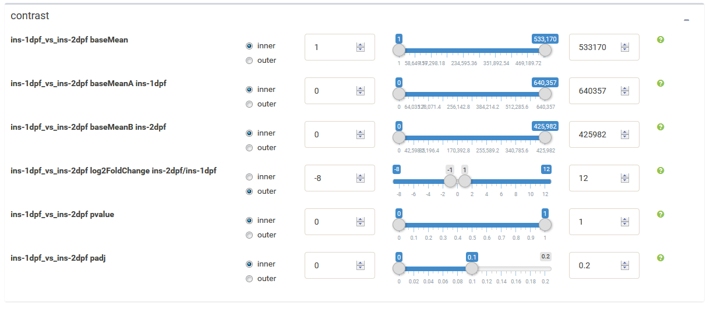

 In order to narrow down the selection further to <b>protein coding genes</b> involved in the <i>BMP signaling pathway</i>, select the <b>feature</b> level next and enter the desired annotation filters.

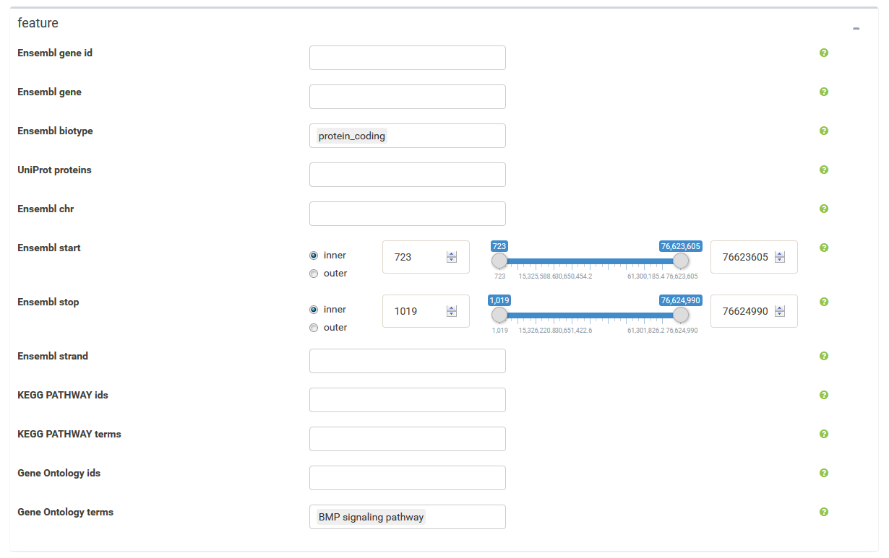

 Finally click the select button to apply all filters and create the subset of interest, leading to the table below.

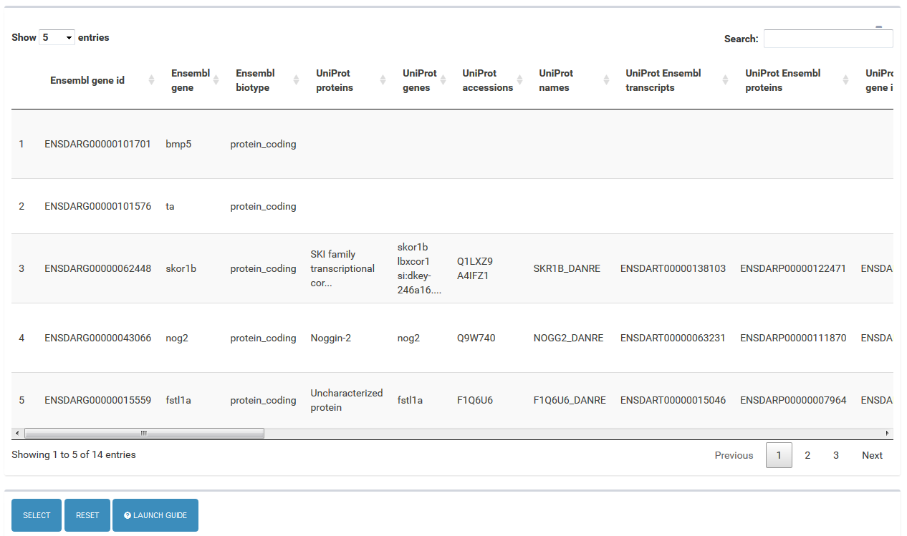

 Now with this preselction of features move on to the heatmap module (here not interactive). Select the <b>samples</b> of interest and click on the plot button.

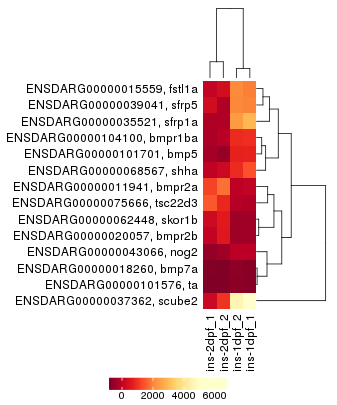

 The resulting plot is troubled by the large range of the values (0-7000) which can hinder the recognition of patterns. A row-wise z-score <b>Transformation</b> might help.

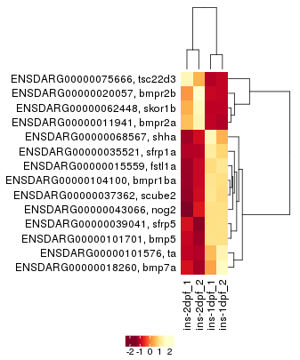

 Since the z-score transformation leads to a diverging (2-sided: -x..0..+x) distribution of values, another color palette would be optimal. Set <b>Data distribution</b> to diverging and select the <i>spectral color</i> scheme. To simplify interpretation, a label should be set for the legend (e.g. z score).

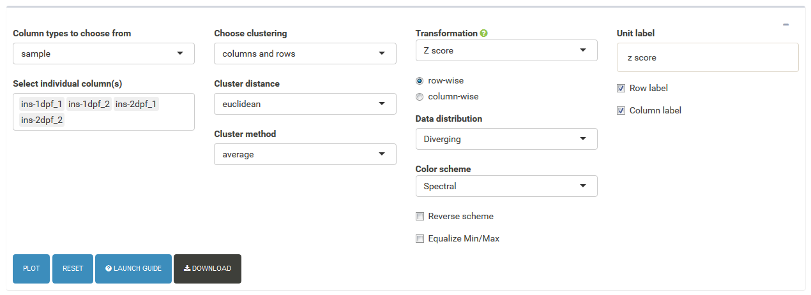
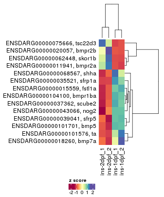

### Case 2

<b>Plot Top15 most highly expressed genes, which are significantly differentially expressed, and involved in apoptosis</b> 
 
To accomplish this task the first step is to create a suitable subset. Use the feature selector to filter for significant genes by setting the threshold of the multiple testing adjusted p-value (padj) to <= 0.01. This is done in the <b>contrast</b> level.

Further filter for the <i>apoptosis pathway</i> within the <b>feature</b> level.

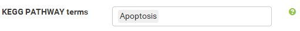

The following line plot shows the counts per condition per gene using a random order and including also genes with a low expression on average.

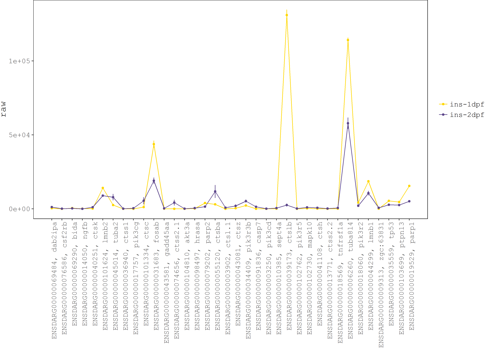

To only select genes with a relatively high expression, reorder the table by clicking the desired column name. In this case we reorder the table descending after the <b>baseMean</b> column (=average counts of both conditions). Furthermore the amount of features is limited to the top 15 with the slider below. Now the first 15 rows will be highlighted and are forwarded for plotting.

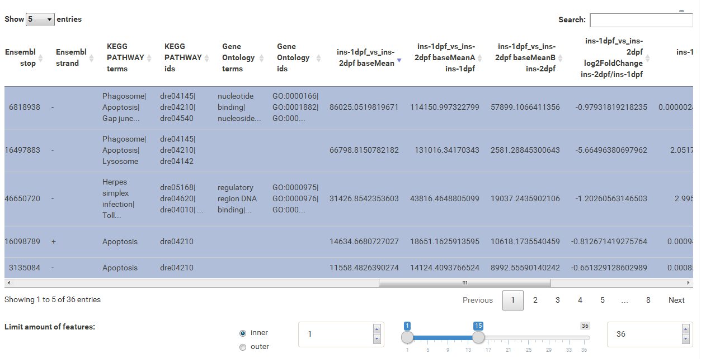
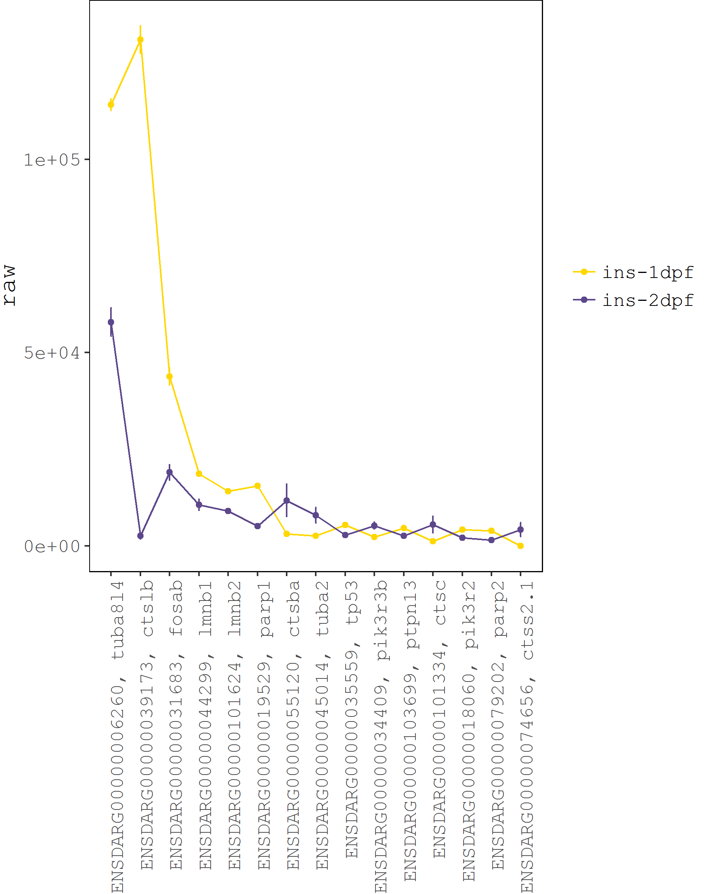

### Case 3

<b>Create scatterplot of non-coding RNAs including labeling of those with the most prominent up-regulation</b> 
 
<b>Data set</b>: <i>RNAseq_Zhang_2015.se</i>. First select non-coding RNAs on the <b>feature</b> level: <b>Ensembl biotype</b> = <i>miRNA, lincRNA, antisense</i>. Then switch to the <b>Scatterplot/Simple Scatter</b> tab: choose the <b>X-axis</b> data to be type <i>condition</i>, column <i>wt</i>, transformation <i>log2</i>, and <b>Y-axis</b> data to be type <i>condition</i>, column <i>mt</i>, transformation <i>log2</i>. This will compare the mean normalized counts per condition of the selected non-coding RNAs.

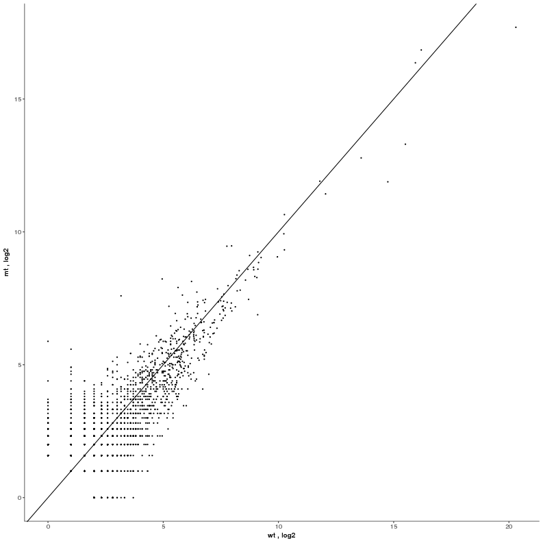

In order to color the scatterplot by Log2FC please choose Z-axis to be type <b>contrast</b> and column <i>Unfitted Log2FoldChange (mt/wt)</i>. Furthermore set the <b>Color scheme</b> to <i>Diverging/BuWtRd</i>. The resulting plot shows RNAs up-regulated in the <i>mt</i> condition using red dots. But the colors are slightly pale and do not seem to be centered around 0.

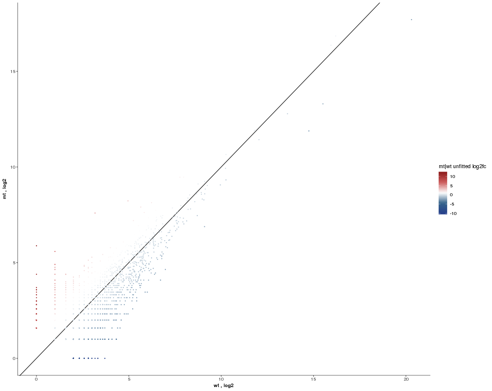

Tick <b>Winsorize to upper/lower</b>, then set <b>Lower limit</b> to <i>-1</i> and <b>Upper limit</b> to <i>1</i> to modify the color palette range to be more intense and centered around 0.

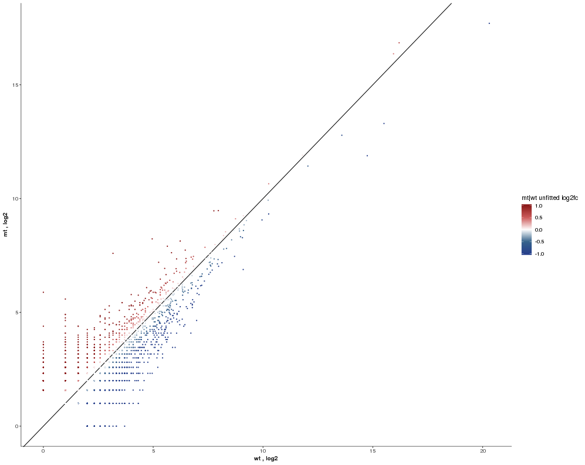

Next please go back to the <b>Feature Selection</b> tab and switch from the Data to the <b>Highlight</b> sub-tab to select a subset of features to be labeled inside the plot. Open the <b>contrast</b> level and select <b>BaseMean</b> <i>>= 100</i> and <b>Unfitted Log2FoldChange (mt/wt)</b> <i>>= 0.5</i> to get RNAs with a certain minimum expression and up-regulated in the mutant. Now switch to the <b>Scatterplot/Simple Scatter</b> tab again and set the <b>Highlight/Label Selected Features</b> on the side bar to <i>Highlight</i>. Furthermore change <b>Select label column</b> to <i>Ensembl gene</i> to use the gene symbol for display as a label.

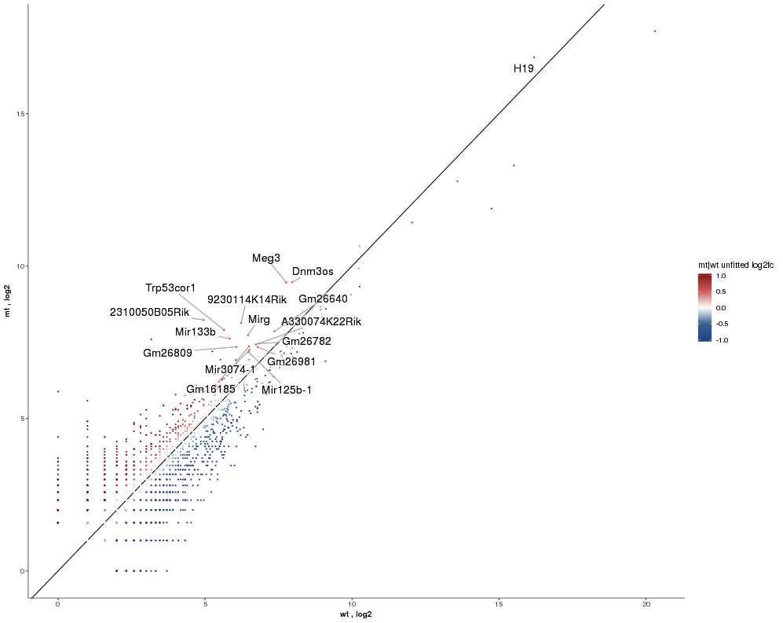

 

##  Contact and License

 
Wilson was created by Hendrik Schultheis, Jens Preussner, Carsten Kuenne, and Mario Looso.
  
Bioinformatics Core Unit, Max Planck Institute for Heart and Lung Research, Bad Nauheim, Germany.
  
Copyright (C) 2017. This project is licensed under the MIT license.
  
The source code for the modular Wilson R package is available on <a href="https://github.molgen.mpg.de/loosolab/wilson">Github.</a>
 
The source code for the Wilson application implementing that package is available on <a href="https://github.molgen.mpg.de/loosolab/wilson-apps">Github.</a>
 
The container for the Wilson application ist available on <a href="https://hub.docker.com/r/loosolab/wilson/">Docker.</a>

