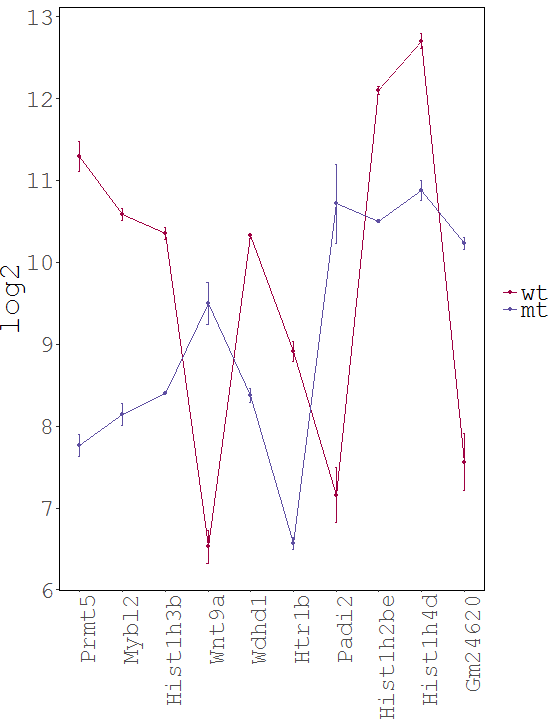

<head>
 
</head>

# WIlsON: Webbased Interactive Omics visualizatioN

 The WIlsON app is intended to interpret all types of quantitative data (e.g. multi-omics) which can be broken down to a key feature (such as genes or proteins) and assigned text columns and/or numeric values. It is designed to support common experimental designs by making use of individual data levels resulting from primary analysis. 
  
 Once the experimental data is loaded into the app, the user can generate various plots following four basic steps: 
 
 <ol class="font">
 <li>Filter for features of interest based on categorical (annotation) or numerical values (e.g. transcripts, genes, proteins, probes)</li>
 <li>Select plot type</li>
 <li>Adjust plot parameters</li>
 <li>Render/download result</li>
 </ol>

##  Examples

 
## Please check the <a href="https://github.molgen.mpg.de/loosolab/wilson-apps/wiki">**documentation**</a> for a detailed introduction to WIlsON!
## Access the demo datasets <a href="https://github.molgen.mpg.de/loosolab/wilson-apps/tree/master/wilson-basic/data">**here**</a>.

 

##  Contact and License

 
Wilson was created by Hendrik Schultheis, Jens Preussner, Carsten Kuenne, and Mario Looso.
  
Bioinformatics Core Unit, Max Planck Institute for Heart and Lung Research, Bad Nauheim, Germany.
  
Copyright (C) 2017. This project is licensed under the MIT license.
  
The source code for the modular Wilson R package is available on <a href="https://github.molgen.mpg.de/loosolab/wilson">Github.</a>
 
The source code for the Wilson application implementing that package is available on <a href="https://github.molgen.mpg.de/loosolab/wilson-apps">Github.</a>
 
The container for the Wilson application ist available on <a href="https://hub.docker.com/r/loosolab/wilson/">Docker.</a>

