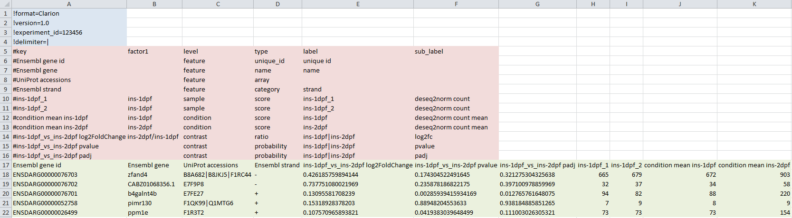
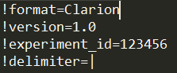
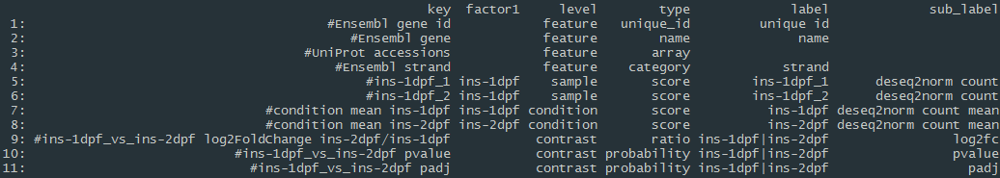
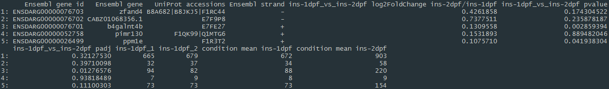

# Data Format
**CLARION: generiC fiLe formAt foR quantItative cOmparsions of high throughput screeNs**

CLARION is a data format especially developed to be used with WIlsON, which relies on a tab-delimited table with a metadata header to describe the following columns. It is based on the Summarized Experiment format and supports all types of data which can be reduced to features and their annotation (e.g. genes, transcripts, proteins, probes) with assigned numerical values (e.g. count, score, log2foldchange, z-score, p-value). The feature annotations (e.g. symbol, GO category, KEGG pathways, etc.) and numerical values can later be used for filtering and plotting. Minimally, a row in such a table has to contain a unique identifier for the feature (e.g. accession) and one numerical value. Most result tables derived from RNA-Seq, ChIP/ATAC-Seq, Proteomics, Microarrays, and many other analyses can thus be easily reformatted to become compatible without having to modify the code of WIlsON for each specific experiment.

It is suggested to use a spreadsheet software (e.g. Excel) to perform a manual reformat of the original tab-delimited table (shown in green in the following figure) in order to avoid errors due to shifted columns. In order to become CLARION, two blocks of descriptive information have to be inserted above the original table called header (red) and metadata (blue).

The format consists of three blocks of tab-delimited data layered on top of each other. These follow distinct structures:
  
* **Header** (blue): Parameters concerning the global experiment. Most of these are for connection to surrounding workflows and can be ignored.
* **Metadata** (red): Parameters describing the content of each data column. Most importantly, these categorize the columns into 4 different **levels**: feature (= annotation; can only be used for filtering and plot labeling) and sample/condition/contrast (= numeric values; can be used for filtering and plotting). The grouping of the numeric values into multiple levels is intended to simplify later user selections inside the web interface and has no further use as of now. The **type** category designates e.g. the unique identifier column (*unique_id*) and the column having the default name for the feature (*name*). The remaining categories (**factor**/**label**/**sub_label**) are optional and mostly change the labels shown inside the web interface.</li>
* **Data** (green): Matrix of tab-delimited data columns bearing textual and numerical information per feature (= the original table).

## Header:

* Line identifier: '!'
* Syntax: name = value
* Mandatory columns are marked with an asterisk (*) in the following description.

### Parameters:
* **format**: Name of the file format (must be Clarion)
* **version**: Version of the file format (1.0)
* **experiment_id**: Unique id to be used for the experiment
* **delimiter**(*): In-field delimiter for multi-value fields (e.g. multiple KEGG pathways). Multi-character delimiters are possible (e.g. ", "). This permits filtering according to the single elements found in this column (e.g. "regulation of transcription, transporter activity" would be interpreted as having the separate values "regulation of transcription" and "transporter activity").

## Metadata:

* Line identifier: '#'
* Mandatory columns are marked with an asterisk (*) in the following description.

### Columns:
* **key***:
  * Reference to data matrix (column headline)
  * Must be unique
    * **factor1 - factorN**:
    * Denotes experimental factors (e.g. wildtype, mutant, time point) per sample and condition
      <ul class="font"><li>One or more columns (factor1, factor2, ..., factorN)</li></ul>
      <ul class="font"><li>Used for grouping</li></ul>
    <li>**level***:</li>
      <ul class="font">
        <li>Classifies content of column</li>
        <li>Must be one of:</li>
        <ul class="font">
          <li>*sample:* Data relating to a single sample</li>
          <li>*condition:* Data relating to a single condition (combination of all samples; e.g. average count)</li>
          <li>*contrast:* Data relating to a single contrast (pairwise comparison of conditions)</li>
          <li>*feature:* Annotation relating to a feature (e.g. gene, transcript, probe, protein, ...)</li>
        </ul>
      </ul>
    <li>**type(*)**:</li>
      <ul class="font">
        <li>Mandatory for multi-value fields</li>
        <li>Further classify content level</li>
        <li>Must be one of:</li>
        <li>For level = feature = values to be filtered for</li>
        <ul class="font">
          <li>*unique_id:* Unique identifier (e.g. ENSMUSG00000023944)</li>
          <li>*name:* Main feature name / symbol / label (e.g. Hsp90ab1)</li>
          <li>*category:* Single value per field; categorical data (e.g. protein_coding)</li>
          <li>*array:* Multiple delimited values per field; categorical data (e.g. Cholinergic synapse|Choline metabolism in cancer)</li>
        </ul>
        <li>For levels = sample, condition, contrast = values to be plotted</li>
        <ul class="font">
          <li>*score:* count, intensity, ...</li>
          <li>*ratio:* foldchange, log2foldchange, ...</li>
          <li>*probability:* pvalue, padj, ...</li>
          <li>*array:* Multiple numeric values per field; e.g. coverage/windows, ...</li>
        </ul>
        <li>Attention: if the type is not given, the first feature column is expected to hold a unique identifier!</li>
      </ul>
    <li>**label**:</li>
      <ul class="font">
        <li>Optional label alternative to column name</li>
        <li>Can be used for plotting</li>
        <li>Should be unique</li>
        <li>For level = contrast delimited by '|' (condition1|condition2)</li>
      </ul>
    <li>**sub_label**:</li>
      <ul class="font"><li>Optional more detailed label to offer a logical subselection of a column using the interface</li></ul>
  </ul>

 
##  Data:

  <ul class="font">
    <li>Traditional tab-delimited data matrix</li>
    <li>Minimum: one column with a unique id; one column with a numerical value</li>
    <li>If types are missing first column will be treated as unique_id</li>
  </ul>

